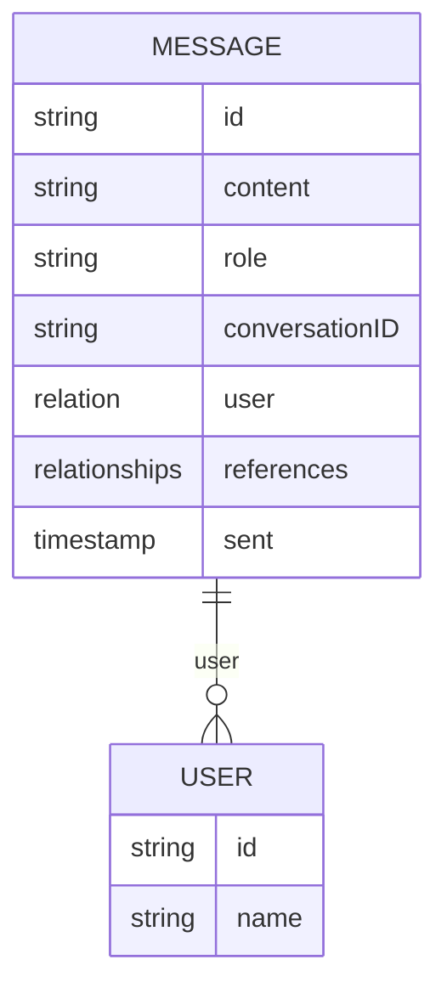

# Chat Message Collection

## Purpose

Stores each message in a conversation, making them available to use as context and display to the user

## Interface

## Key Details

- Collection Will be added to the payload configuration during plugin initialization.
- Messages Will be readable only by the user who created it
- Messages Supports roles: 'assistant' and 'user' and 'tools
- References field can store links to relevant documents used
- Timestamp allows for chronological ordering of messages
