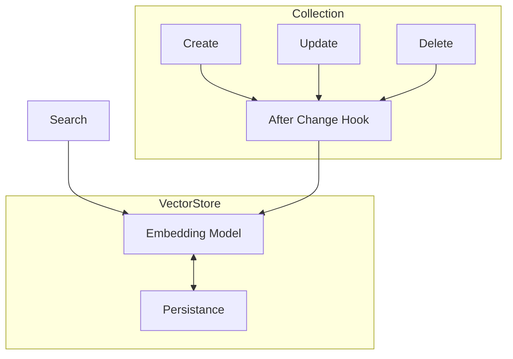

# Indexable Fields

## Purpose

Easily define what to index and how to query it using Payload Fields. This enables using existing fields or creating hidden virtual ones. Indexes are partitioned for performance and automatically integrate via collection hooks.

## Interface

## Key Details

- Configure any field by name `collection.field`
- Backfills existing fields
- Updates only when field changes

